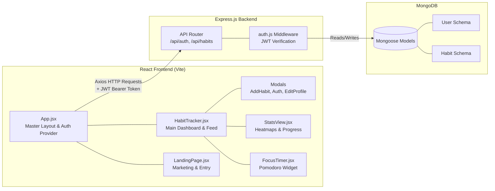
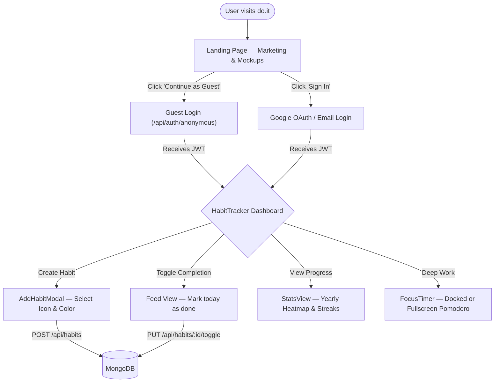
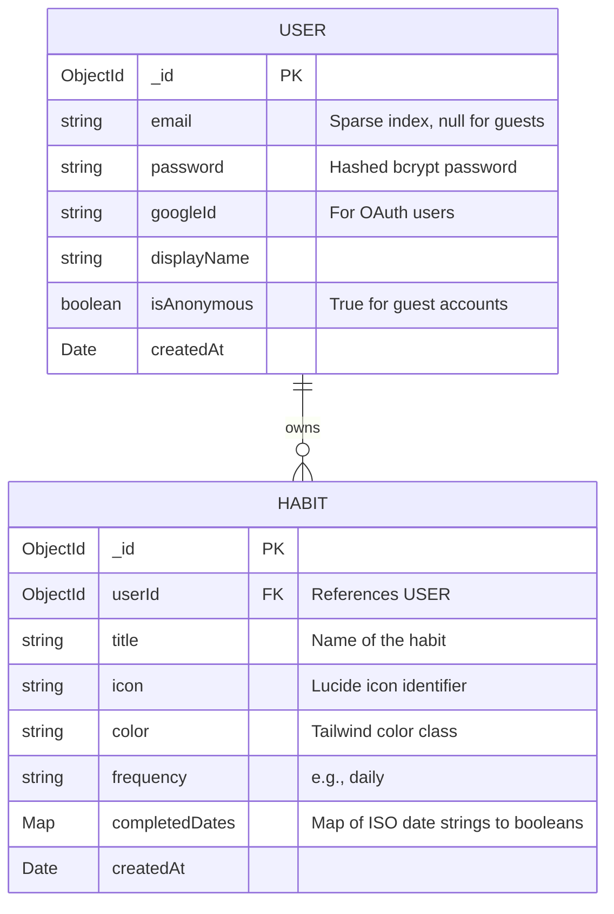

<div align="center">
  

  <br />
  <br />

  # **do.it**
  **A Liquid Glass Habit Tracker. Build Streaks. Stay in the Zone.**

  <p align="center">
    
    
    
    
    
    
    
  </p>
</div>

<br />

> **🚀 Official Documentation:** [docs.uraj.dev/doit-mern](https://docs.uraj.dev/doit-mern) — Read deep dives into the MERN migration, JWT Auth, stateless API design, and component architecture.

---

## ✦ Table of Contents 🟦

1. [What is do.it?](#what-is-doit)
2. [System Architecture](#system-architecture)
3. [User Flow](#user-flow)
4. [Core Features](#core-features)
5. [Database Schema](#database-schema)
6. [Project Structure](#project-structure)
7. [Component Breakdown](#component-breakdown)
8. [Environment Setup](#environment-setup)
9. [Installation & Running Locally](#installation--running-locally)
10. [How Things Work Under the Hood](#how-things-work-under-the-hood)

---

## What is do.it?

**do.it** is not just another to-do list. It is a comprehensive habit-building ecosystem that focuses on visual rewards (heatmaps and streaks) and active engagement (built-in focus timers). Originally built on Firebase, it has been **fully migrated to a robust MERN stack architecture**.

The application is designed to be completely frictionless: users can jump right in as an Anonymous Guest without creating an account, and seamlessly link their data to a permanent Google or Email account later.

It is heavily optimized for desktop, featuring **keyboard navigation**, minimal distractions, and a deeply atmospheric **Liquid Glass visual style** that changes ambiently based on your system theme.

---

## System Architecture



---

## User Flow



---

## Core Features

### 🔐 Frictionless Authentication (Anonymous-First)
Users can instantly access the app as a Guest. The Express backend generates a secure JWT and a temporary MongoDB User document. When the user is ready, they can "Link Account" via Google OAuth or Email, permanently securing their guest data without any migration loss.

### 💧 Fluid Liquid Glass Interface
A stunning, dynamic UI that utilizes extreme CSS backdrop-filters, custom lighting gradients, and smooth Framer Motion transitions. Fully supports Dark and Light modes out of the box by reading system preferences.

### 🔥 Smart Streaks & Heatmaps
Automatically calculates current and best streaks on the client-side (saving expensive server aggregations). Renders your habit history on a GitHub-style yearly activity heatmap.

### ⏱️ Deep Focus Timer
A built-in Pomodoro-style timer that operates in two modes: a compact "docked" mode that sits at the bottom of the screen, or an immersive "fullscreen" mode.

### 🧠 Draft Memory
Modal forms automatically remember partial user inputs (drafts) using `localStorage`, ensuring you never lose data even if you accidentally close a window.

### ⌨️ Keyboard First
Built for power users. Press `Enter` to submit modals, toggle features rapidly, and navigate the app without ever touching the mouse.

---

## Database Schema

All data lives in a MongoDB cluster, modeled using Mongoose.



**Key Optimizations**:
- **Sparse Indexing**: The `User` schema uses `sparse: true` on the `email` field. This allows thousands of Anonymous guests to exist without triggering MongoDB duplicate key errors for `null` emails.
- **O(1) Lookups**: The `Habit` schema stores `completedDates` as a `Map` of strings instead of an Array. This guarantees O(1) time complexity when the frontend checks if a habit was completed on a specific day.

---

## Project Structure

```text
doit-mern/
├── backend/                  # Express API Server
│   ├── models/               # Mongoose Schemas (User, Habit)
│   ├── routes/               # API endpoints
│   │   ├── auth.js           # JWT issuance and validation
│   │   └── habits.js         # Habit CRUD operations
│   ├── server.js             # Express entry point
│   └── package.json
│
├── frontend/                 # React SPA
│   ├── public/               # Static assets & Logo
│   ├── src/
│   │   ├── components/       # All UI Components
│   │   ├── contexts/         # AuthContext & ThemeContext
│   │   ├── lib/              # Axios instance & utils
│   │   ├── App.jsx           # Root layout
│   │   └── index.css         # Global Tailwind & Glass variables
│   ├── tailwind.config.js
│   └── vite.config.js
│
├── LICENSE
├── CONTRIBUTING.md
├── CODE_OF_CONDUCT.md
└── README.md                 # You are here
```

---

## Component Breakdown

### `HabitTracker.jsx` — The Core Dashboard
The central hub of the application. It fetches the user's habits on mount and manages state for the main views (Feed vs. Statistics). It orchestrates all the underlying modals.

### `LandingPage.jsx` — Presentation & Onboarding
A rich marketing page shown to unauthenticated users. Features a mocked dashboard, floating UI elements, and a smooth onboarding funnel.

### Modals (`AddHabitModal`, `AuthModal`, `EditProfileModal`)
Highly animated, macOS-style window overlays. They trap focus and support keyboard shortcuts. The `AuthModal` gracefully handles the complex logic of upgrading an Anonymous JWT session into a permanent Google session.

### Data Visualization (`StatsView.jsx`, `Heatmap.jsx`)
`Heatmap.jsx` processes the raw `completedDates` Map from MongoDB into a structured 7-day by 52-week grid, calculating color intensities based on the user's daily completion volume.

### Contexts (`AuthContext`, `ThemeContext`)
- **`AuthContext`**: Manages the global JWT lifecycle. Injects the Bearer token into Axios interceptors, handles auto-logout on token expiry, and provides user state to the entire tree.
- **`ThemeContext`**: Reads `prefers-color-scheme` and manages the injection of the `.dark` class into the HTML root for seamless Tailwind dark mode styling.

---

## Environment Setup

### 1. Backend (`/backend/.env`)

```env
PORT=5001
MONGO_URI=mongodb+srv://<username>:<password>@cluster.mongodb.net/doit
JWT_SECRET=generate_a_super_secret_random_string_here
GOOGLE_CLIENT_ID=your_google_oauth_client_id.apps.googleusercontent.com
```

### 2. Frontend (`/frontend/.env`)

```env
VITE_API_URL=http://localhost:5001/api
VITE_GOOGLE_CLIENT_ID=your_google_oauth_client_id.apps.googleusercontent.com
```

---

## Installation & Running Locally

1. **Clone the repository**:
   ```bash
   git clone https://github.com/yuvrajshrirame/doit-mern.git
   cd doit-mern
   ```

2. **Start the Backend**:
   ```bash
   cd backend
   npm install
   node server.js
   ```

3. **Start the Frontend**:
   Open a new terminal window:
   ```bash
   cd frontend
   npm install
   npm run dev
   ```

4. **Open in Browser**: Navigate to `http://localhost:5173`.

---

## How Things Work Under the Hood

### Stateless JWT Authentication
Instead of relying on server-side sessions, the backend uses completely stateless JSON Web Tokens. When a user logs in, the server signs a JWT payload containing their `userId`. 
The frontend stores this token in `localStorage` and an Axios Interceptor automatically attaches it as an `Authorization: Bearer <token>` header to every outgoing request.

### Cross-Origin Resource Sharing (CORS)
The Express backend is explicitly configured with `cors()` to allow requests originating from `localhost:5173` (the Vite dev server). This prevents browser security blocks during local development.

### Streak Calculation Algorithm
To save server costs and latency, streak calculation is done entirely on the client-side. The `calculateStreak` utility function sorts the `completedDates` Map, checks for contiguous days (accounting for today and yesterday), and calculates both the `currentStreak` and the `bestStreak` dynamically before rendering the UI.

<br />

<div align="center">
  <sub>Built with 💧 by Yuvraj</sub>
</div>
