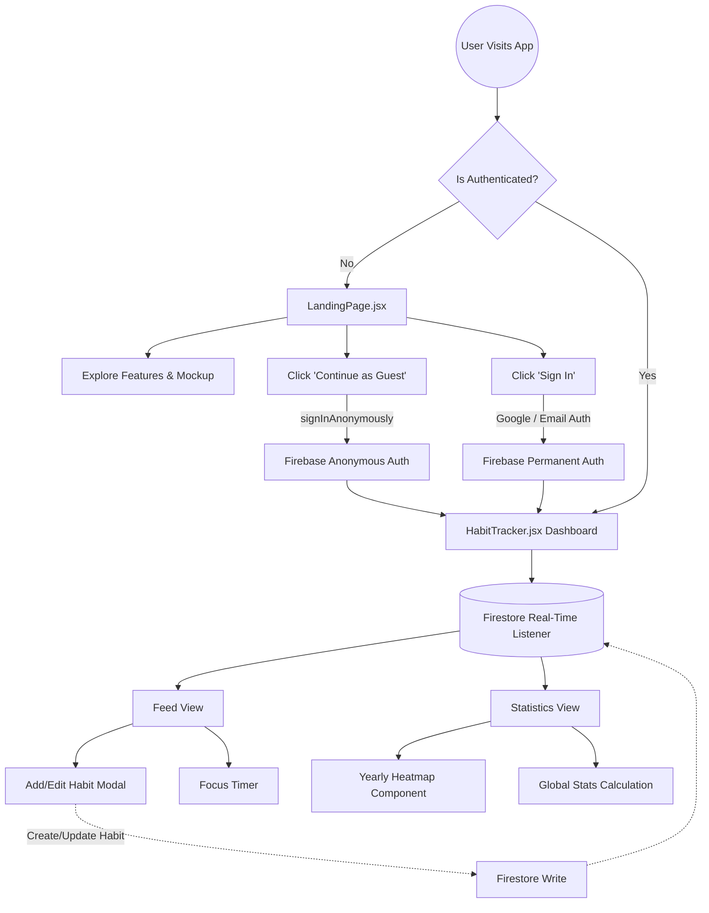

# do.it - documentation

A beautiful, highly interactive, glassmorphism-inspired habit tracker designed for deep focus and seamless continuity. Built with a "keyboard-first" philosophy and a stunning Apple-inspired Liquid Glass aesthetic, **doit** helps you build streaks, track your progress, and stay in the zone.

> **🚀 Official Documentation:** [docs.uraj.dev/doit](https://docs.uraj.dev/doit) — Read deep dives into the Anonymous-First Auth, robust streak algorithms, and fluid Framer Motion animations that power do.it.

---

## 📖 Table of Contents

1. [Overview](#-overview)
2. [Tech Stack](#-tech-stack)
3. [Architecture & Flow](#-architecture--flow)
4. [Core Features](#-core-features)
5. [Project Architecture Directory](#-project-architecture-directory)
6. [Component Documentation](#-component-documentation)
7. [State & Data Management](#-state--data-management)
8. [Authentication Flow](#-authentication-flow)
9. [UI & Styling System](#-ui--styling-system)
10. [Installation & Setup](#-installation--setup)
11. [How to Use](#-how-to-use)

---

## 🔭 Overview

**doit** is not just another to-do list. It is a comprehensive habit-building ecosystem that focuses on visual rewards (heatmaps and streaks) and active engagement (built-in focus timers). The application is designed to be completely frictionless: users can jump right in as an Anonymous Guest without creating an account, and seamlessly link their data to a permanent Google or Email account later.

It is heavily optimized for desktop, featuring keyboard navigation, minimal distractions, and a deeply atmospheric visual style that changes ambiently based on your system theme.

---

## 🛠 Tech Stack

- **Framework**: [React 18](https://reactjs.org/)
- **Build Tool**: [Vite](https://vitejs.dev/)
- **Styling**: [Tailwind CSS](https://tailwindcss.com/)
- **Animations**: [Framer Motion](https://www.framer.com/motion/)
- **Backend & Database**: [Firebase](https://firebase.google.com/) (Auth & Firestore)
- **Icons**: [Lucide React](https://lucide.dev/)
- **Utility Libraries**: `clsx` and `tailwind-merge` (for dynamic class compilation)

---

## 📐 Architecture & Flow

The following diagram illustrates how a user flows through the application and how components interact with Firebase.



---

## ✨ Core Features

1. **Fluid Liquid Glass Interface**: A stunning, dynamic UI that utilizes extreme CSS backdrop-filters, custom lighting gradients, and smooth Framer Motion transitions. Fully supports Dark and Light modes.
2. **Anonymous-First Onboarding**: Users can instantly access the app as a Guest. Their data is saved locally via Firebase Anonymous Auth, which can later be merged into a permanent account.
3. **Deep Focus Timer**: A built-in Pomodoro-style timer that docks at the bottom of the screen or expands into a beautiful fullscreen focus view.
4. **Smart Streaks & Heatmaps**: Automatically calculates current and best streaks, rendering them on a GitHub-style yearly activity heatmap.
5. **Draft Memory**: Modal forms automatically remember partial inputs (drafts) even if accidentally closed.
6. **Keyboard First**: Built for power users. Press `Enter` to submit modals, toggle features rapidly, and navigate without ever touching the mouse.

---

## 🏗 Project Architecture Directory

The project follows a modular React architecture, strictly separating UI components from context providers and pure utility functions.

```text
src/
├── components/          # All React UI components
│   ├── AddHabitModal.jsx
│   ├── AuthModal.jsx
│   ├── BackgroundGlow.jsx
│   ├── ConfirmationModal.jsx
│   ├── EditProfileModal.jsx
│   ├── FocusTimer.jsx
│   ├── HabitTracker.jsx
│   ├── Heatmap.jsx
│   ├── LandingPage.jsx
│   └── StatsView.jsx
├── contexts/            # React Contexts (ThemeContext)
├── firebase/            # Firebase initialization and config
├── lib/                 # Third-party utility wrappers (cn)
├── utils/               # Core business logic and pure functions
├── App.jsx              # Application root wrapper
├── index.css            # Global CSS and Design System variables
└── main.jsx             # React DOM entry point
```

---

## 🧩 Component Documentation

### Main Layout
* **`App.jsx`**: The root component. It provides the `ThemeProvider` and mounts the `HabitTracker`.
* **`HabitTracker.jsx`**: The core dashboard and router. It handles the real-time Firestore `onSnapshot` listener to fetch the user's habits, manages the global state for modals (Add, Edit, Auth), and handles the navigation between the main "Feed" and the "Statistics" view.
* **`LandingPage.jsx`**: A rich, animated marketing page shown to unauthenticated users. Features a mocked dashboard, floating UI elements, a Bento Grid feature highlight, and a seamless CSS Marquee of user reviews.
* **`BackgroundGlow.jsx`**: A purely visual component that renders ambient, slowly rotating blurred orbs in the background. It dynamically changes its color palette based on whether the app is in Light or Dark mode.

### Modals & Forms
* **`AddHabitModal.jsx`**: A complex, animated macOS-style window used for both creating and editing habits. It supports keyboard shortcuts (`Enter` to submit) and saves partial user inputs as drafts using `localStorage`.
* **`AuthModal.jsx`**: Handles the authentication logic. Supports Email/Password sign-up and login, as well as Google OAuth via popups. It gracefully handles upgrading Anonymous accounts to permanent accounts using `linkWithPopup` and `linkWithCredential`.
* **`EditProfileModal.jsx`**: Allows the user to update their Firebase `displayName`.
* **`ConfirmationModal.jsx`**: A reusable, generic prompt used to confirm destructive actions (like deleting a habit).

### Data Visualization & Tools
* **`StatsView.jsx`**: The main statistical dashboard. It calculates aggregate metrics like overall completion rate and total habits, and mounts the `Heatmap`.
* **`Heatmap.jsx`**: Processes raw habit completion dates into a structured 7-day by 52-week grid. Calculates color intensities based on the number of habits completed on a specific day compared to the user's total active habits.
* **`FocusTimer.jsx`**: A robust timer component. It operates in two modes: a compact "docked" mode and an immersive "fullscreen" mode. It supports multiple work intervals (e.g., Deep Work, Short Break) and tracks the number of completed Pomodoro cycles.

---

## 💾 State & Data Management

### Firebase Firestore Structure
The app uses a NoSQL document structure in Firestore. All habits are stored in a top-level `habits` collection, heavily secured by Firebase Security Rules ensuring users can only read/write documents where `userId` matches their Auth UID.

**Habit Document Schema:**
```javascript
{
  id: string,               // Firestore Document ID
  userId: string,           // Owner's Firebase Auth UID
  title: string,            // Habit name
  icon: string,             // Emoji identifier
  color: string,            // Tailwind color class
  frequency: string,        // e.g., 'daily', 'weekly'
  createdAt: timestamp,     // Initialization date
  completedDates: string[]  // Array of ISO date strings (e.g., "2026-08-12")
}
```

### Pure Utility Functions (`src/utils/helpers.js`)
* `getTodayStr()`: Standardizes the current date to a local ISO string (YYYY-MM-DD) to prevent timezone bugs when tracking daily completions.
* `calculateStreak(completedDates)`: A robust algorithm that sorts the dates, checks for contiguous days (accounting for today and yesterday), and calculates both the `currentStreak` and the `bestStreak`.

---

## 🔐 Authentication Flow

**doit** employs a frictionless authentication strategy:
1. **Anonymous Guest Mode**: Triggered via `signInAnonymously()`. The user gets a legitimate Firebase UID, allowing them to use the app immediately. Data is written to Firestore normally.
2. **Account Linking**: If an Anonymous user decides to "Link Account", the app uses `linkWithPopup(GoogleAuthProvider)` or `linkWithCredential(EmailAuthProvider)`. This safely attaches permanent credentials to the existing UID, ensuring absolutely zero data loss.
3. **Standard Login**: Standard users bypass the Guest mode entirely using `signInWithPopup` or `signInWithEmailAndPassword`.

---

## 🎨 UI & Styling System

The application uses **Tailwind CSS** heavily augmented with custom CSS variables in `index.css`.

### The Apple Liquid Glass Aesthetic
Instead of flat colors, the app relies on stacking translucent layers with heavy backdrop filters. This is defined in `@layer utilities` in `index.css`:

* `.glass-card`: The primary surface material. Uses `backdrop-filter: blur(40px) saturate(180%) brightness(1.05)` combined with subtle white borders and drop shadows to simulate thick, frosted glass.
* `.glass`: A secondary, slightly lighter glass for navigation bars and inner panels.
* `.glass-glow`: Adds a responsive cyan drop-shadow on hover to simulate interactive depth.

### Theme Context
The `ThemeContext.jsx` intelligently reads the user's system preference (`prefers-color-scheme`) on the first load and saves explicit overrides to `localStorage`. It dynamically injects the `.dark` class into the root HTML element, allowing Tailwind's `dark:` modifier to orchestrate the entire color scheme flawlessly.

---

## 🚀 Installation & Setup

To get this project running on your local machine, follow these steps:

### 1. Clone the Repository
```bash
git clone https://github.com/yuvrajshrirame/do-it.git
cd do-it
```

### 2. Install Dependencies
```bash
npm install
```

### 3. Firebase Configuration
Because this app relies entirely on Firebase for Authentication and Database storage, you must set up your own Firebase project.

1. Go to the [Firebase Console](https://console.firebase.google.com/) and create a new project.
2. **Enable Firestore Database**: Create a database in test mode (or set up proper security rules for production).
3. **Enable Authentication**: Go to Authentication > Sign-in method and enable:
   - Email/Password
   - Google
   - Anonymous
4. **Register Web App**: Add a web app to your Firebase project to get your configuration keys.

### 4. Environment Variables
Create a `.env` file in the root of the project and paste your Firebase configuration keys:

```env
VITE_FIREBASE_API_KEY=your_api_key
VITE_FIREBASE_AUTH_DOMAIN=your_project_id.firebaseapp.com
VITE_FIREBASE_PROJECT_ID=your_project_id
VITE_FIREBASE_STORAGE_BUCKET=your_project_id.appspot.com
VITE_FIREBASE_MESSAGING_SENDER_ID=your_sender_id
VITE_FIREBASE_APP_ID=your_app_id
```

### 5. Start the Development Server
```bash
npm run dev
```
The app should now be running at `http://localhost:5173`.

---

## 🎮 How to Use

1. **Guest Mode**: On the Landing Page, click "Continue as Guest". You will be dropped immediately into the dashboard. 
2. **Create a Habit**: Click the "Add Habit" button or use your keyboard. Pick an icon, a color, and hit enter.
3. **Check it off**: In the Feed view, simply click the circle next to a habit to mark it as done for the day.
4. **Focus Timer**: Click the tiny stopwatch icon on any habit card to open the Focus Timer. You can minimize it to the bottom of the screen or expand it to fill the entire window while you work.
5. **Statistics**: Switch over to the "Statistics" tab in the top navigation to view your all-time metrics, completion rates, and your GitHub-style Yearly Consistency Heatmap.
6. **Save Your Data**: When you are ready to make your account permanent, click on your Profile dropdown in the top right, select "Link Account", and sign in with Google or Email. All your guest data will instantly be transferred to your new permanent account.
